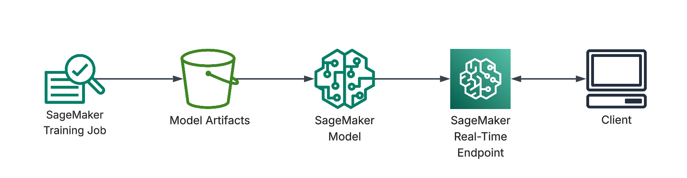

# AWS Fraud Detection with SageMaker

This project implements an end-to-end machine learning pipeline on AWS for detecting fraudulent credit card transactions.  
The focus is not only on model performance, but on building a production-ready ML workflow using Amazon SageMaker.

The repository demonstrates how a model is:
- trained in a managed cloud environment,
- evaluated with appropriate metrics for imbalanced data,
- deployed as a real-time endpoint,
- and safely cleaned up to control cloud costs.

---

## Architecture Overview

The diagram below shows the end-to-end workflow implemented in this project,
from model training to real-time inference using Amazon SageMaker.



---

## Project Motivation

Fraud detection is a classic highly imbalanced classification problem, where:
- false negatives (missing a fraud) are very costly,
- false positives (blocking legitimate transactions) impact user experience.

This project explores how to handle this trade-off using:
- probability-based predictions,
- a configurable decision threshold,
- and cloud-native ML infrastructure.

---

## What Was Developed (End-to-End)

### 1. Data Ingestion and Preparation

The training pipeline was designed to work both locally and inside SageMaker without code changes.

Key points:
- The training script (`model/train.py`) accepts either:
  - a direct CSV path (local development), or
  - a SageMaker training channel directory (cloud execution).
- The script automatically detects the correct input source.
- The dataset is validated to ensure the presence of the `Class` column (binary target).

To correctly evaluate fraud detection, a stratified train-test split is used, ensuring that the rare fraud cases are proportionally represented in both sets.

---

### 2. Baseline Model Development

A Logistic Regression model was intentionally chosen as a strong, interpretable baseline.

Model pipeline:
- `StandardScaler` for feature normalization
- `LogisticRegression` with:
  - `class_weight="balanced"` to address class imbalance
  - high `max_iter` to ensure convergence

This approach reflects real-world ML practice: start with a simple, explainable baseline before moving to more complex models.

---

### 3. Evaluation Strategy and Metrics

Instead of relying on accuracy (which is misleading for imbalanced datasets), the model evaluation focuses on:

- ROC-AUC: overall ranking quality
- Precision, Recall, and F1-score for the fraud class
- Confusion matrix for interpretability
- Number of alerts generated, which directly relates to operational cost

A custom probability threshold is applied to convert probabilities into fraud alerts, allowing explicit control over the precision–recall trade-off.

All evaluation results are saved as structured JSON files, enabling future monitoring or automated reporting.

---

### 4. Training on Amazon SageMaker

The project uses SageMaker Training Jobs to run the training script in a fully managed environment.

What this includes:
- Automatic provisioning of compute instances
- Containerized execution of the training script
- Automatic upload of model artifacts and metrics to Amazon S3
- No manual server management

The training output consists of:
- `model.joblib` (trained pipeline)
- `metrics.json` (evaluation results)
- `config.json` (decision threshold)

This mirrors how ML models are trained in real production environments.

---

### 5. Real-Time Model Deployment

After training, the model is deployed as a real-time inference endpoint using SageMaker.

Deployment includes:
- Creating a SageMaker Model from the S3 artifact
- Creating an Endpoint Configuration
- Launching a real-time HTTPS endpoint

The inference logic is implemented in `model/inference.py`, which:
- loads the trained model,
- accepts JSON input,
- returns fraud probability predictions.

This enables low-latency predictions suitable for real-time transaction screening.

---

### 6. Endpoint Invocation and Testing

A client script (`scripts/invoke_endpoint.py`) demonstrates how an application would consume the model.

It:
- sends a JSON payload with transaction features,
- invokes the SageMaker Runtime API,
- receives a fraud probability response.

This step validates the full pipeline from: data → model → endpoint → prediction.

### Response Format

The endpoint returns the predicted probability of fraud:

```json
{
  "fraud_probability": 0.01858082651184944
}```


- The value represents the probability that a transaction is fraudulent
- A classification threshold (defined during training) can be applied by downstream systems to convert this probability into a binary decision.
- This design keeps the endpoint flexible and allows business rules to be adjusted without redeploying the model.

---

### 7. Cost-Aware Cleanup

Cloud resources incur cost if left running.  
For this reason, the project includes a cleanup script (`infrastructure/cleanup_endpoint.py`) that:

- deletes the endpoint,
- deletes the endpoint configuration,
- deletes the model.

This ensures good cloud hygiene and reflects real-world operational responsibility.

---

## Why This Project Matters

This repository is not just about training a model.

It demonstrates:
- practical handling of imbalanced classification problems,
- cloud-native ML engineering,
- production-ready structure and scripts,
- understanding of AWS ML services and cost management.

It closely reflects how ML systems are built and operated in industry.

---

## Technologies Used

- Python
- Scikit-Learn
- Amazon SageMaker
- Amazon S3
- Boto3
- IAM Roles

---
